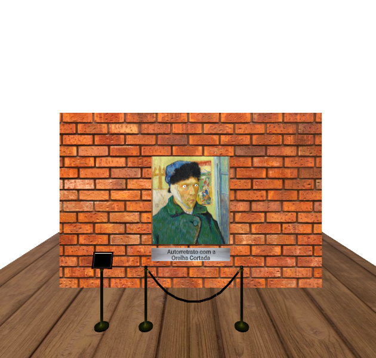

# Olhos que Seguem

## Descrição do Projeto

O projeto se dá em volta da pintura de Vincent Van Gogh chamada “O Quadro”, onde ao mover o mouse ou a câmera, os olhos de Van Gogh lhe seguem.

## Conteúdos Usados

- [Objetos primitivos](https://aframe.io/docs/1.6.0/introduction/html-and-primitives.html)

- [Eventos em JS](https://aframe.io/docs/1.6.0/introduction/javascript-events-dom-apis.html)

- [Objetos em 3D](https://aframe.io/docs/1.6.0/introduction/models.html)

- [Corda de isolamento](https://sketchfab.com/3d-models/grand-entrance-a-pole-with-a-sign-gold-velour-7bb310edac154c5b9ee9c3d6e41f13e2)

## Links de Projeto

- [Código](https://glitch.com/edit/#!/van-gogh-e-os-olhos-que-seguem)

- [Funcionamento](https://van-gogh-e-os-olhos-que-seguem.glitch.me/)
