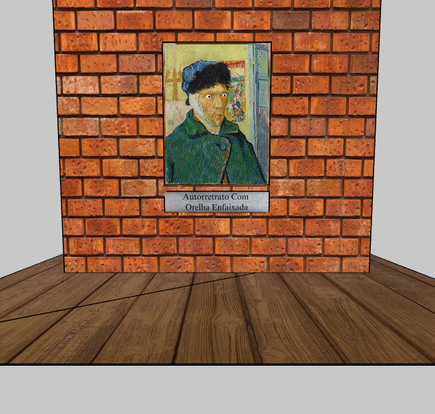

# Olhos que Seguem

## Descrição do Projeto

O projeto se dá em volta da pintura de Vincent Van Gogh chamada “O Quadro”, onde ao mover o mouse ou a câmera, os olhos de Van Gogh lhe seguem.

## Conteúdos Usados

- [Objetos 3D](https://p5js.org/tutorials/lights-camera-materials/)

- [Olhos que seguem 2D](https://p5js.org/examples/angles-and-motion-aim/)

## Links de Projeto

- [Código](https://editor.p5js.org/alexandre11aa/sketches/13EOcOJpx)
